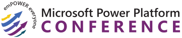

# 🔌 Build Engaging Solutions Across Power Platform Using Human-Centered Design Principles

> [!NOTE]
> This repository is for the "Build Engaging Solutions Across Power Platform Using Human-Centered Design Principles" workshop at the Microsoft Power Platform Conference on Sunday October 1st, 2023 in Las Vegas.

## 📝 Workshop description

Ready to unlock the potential of human-centered innovation? Join us in this immersive workshop as we delve into the principles of design thinking to build engaging experiences with Power Platform. Through hands-on exercises and thought-provoking discussions, you'll discover how to create solutions that make a lasting impact on your users. From uncovering insights to building for inclusivity, we'll guide you through Microsoft's renowned design process. Gain a deeper understanding of your users, harness the power of collaboration, and leave with a fresh perspective and actionable strategies to drive transformative change in your organization.

## 🚀 Key takeaways 

To come...

## ™️ Trademarks

This project may contain trademarks or logos for projects, products, or services. Authorized use of Microsoft
trademarks or logos is subject to and must follow
[Microsoft's Trademark & Brand Guidelines](https://www.microsoft.com/legal/intellectualproperty/trademarks/usage/general).
Use of Microsoft trademarks or logos in modified versions of this project must not cause confusion or imply Microsoft sponsorship.
Any use of third-party trademarks or logos are subject to those third-party's policies.
